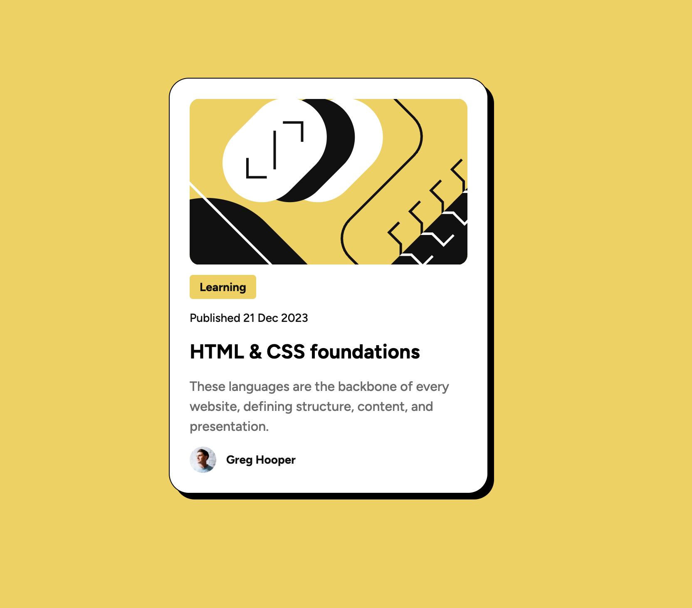

# Frontend Mentor - Blog preview card solution

This is a solution to the [Blog preview card challenge on Frontend Mentor](https://www.frontendmentor.io/challenges/blog-preview-card-ckPaj01IcS). Frontend Mentor challenges help you improve your coding skills by building realistic projects.

## Table of contents

- [Overview](#overview)
  - [The challenge](#the-challenge)
  - [Screenshot](#screenshot)
  - [Links](#links)
- [My process](#my-process)
  - [Built with](#built-with)
  - [What I learned](#what-i-learned)
  - [Continued development](#continued-development)
  - [Useful resources](#useful-resources)
- [Author](#author)

**Note: Delete this note and update the table of contents based on what sections you keep.**

## Overview

### The challenge

Users should be able to:

- See hover and focus states for all interactive elements on the page

### Screenshot

### Links

- Solution URL: [Add solution URL here](https://github.com/MichaelJLarsson/blog-preview-card)
- Live Site URL: [Add live site URL here](https://michaeljlarsson.github.io/blog-preview-card/)

## My process

### Built with

- Semantic HTML5 markup
- CSS custom properties
- Flexbox
- CSS Grid
- Mobile-first workflow

### What I learned

I deepened my knowledge abaout how to use `clamp()` for fluid fonts.

### Continued development

I want to continue to explore how to use `clamp()` while also maintaining accessibility when changing the root font size.

### Useful resources

- [Font-size Clamp Generator](https://clamp.font-size.app) - A nifty helper to calculate `clamp()` properties.
- [CSS-Trix](https://css-tricks.com/linearly-scale-font-size-with-css-clamp-based-on-the-viewport/) - Goes down the rabbit hole of how to calculate `clamp()` values.

## Author

- Frontend Mentor - [@MichaelJLarsson](https://www.frontendmentor.io/profile/MichaelJLarsson)

## Acknowledgments

This is where you can give a hat tip to anyone who helped you out on this project. Perhaps you worked in a team or got some inspiration from someone else's solution. This is the perfect place to give them some credit.

**Note: Delete this note and edit this section's content as necessary. If you completed this challenge by yourself, feel free to delete this section entirely.**

- Frontend Mentor - [@MichaelJLarsson](https://www.frontendmentor.io/profile/MichaelJLarsson)
